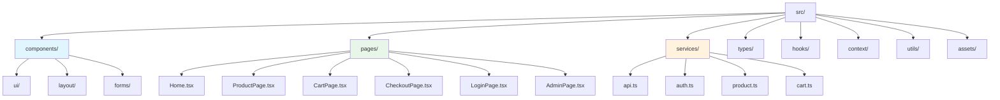
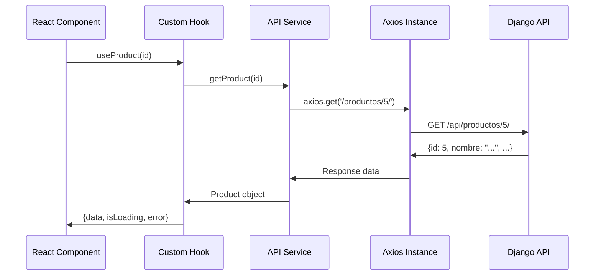
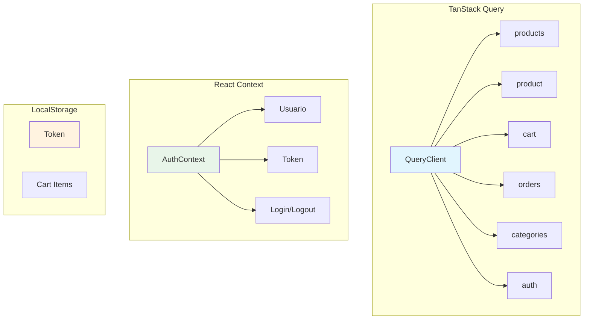
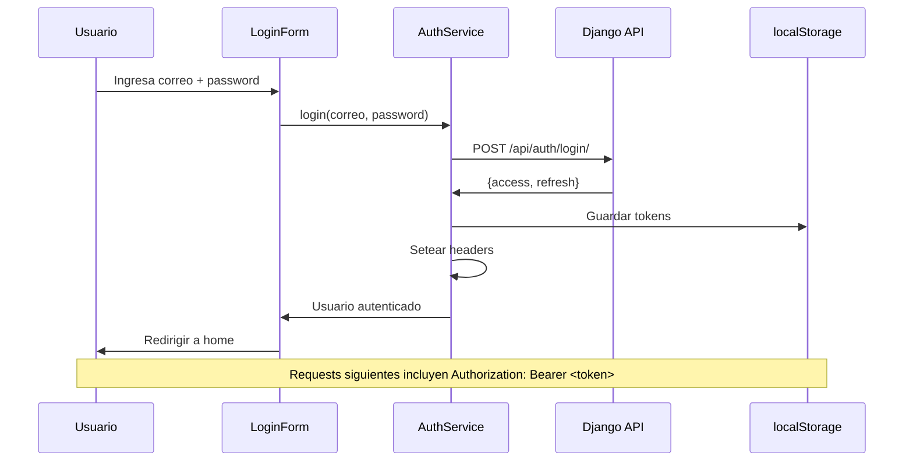
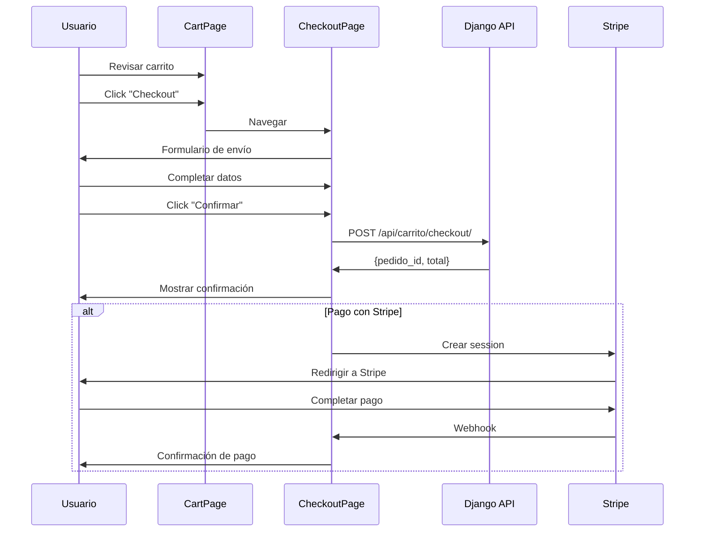

# Catalogo Bukis - Frontend

## React SPA

### Tech Stack
- **Framework:** React 19.x
- **Build Tool:** Vite 7.x
- **Language:** TypeScript 5.9
- **Styling:** Tailwind CSS 4.x + Bulma 1.x
- **Routing:** React Router 7.x
- **Data Fetching:** TanStack Query 5.x
- **HTTP Client:** Axios 1.x
- **Icons:** Lucide React
- **UI Components:** Radix UI

---

## Estructura



---

## Páginas y Rutas

```mermaid
graph TD
    A[App] --> B[Home /]
    A --> C[Producto /producto/:id]
    A --> D[Carrito /carrito]
    A --> E[Checkout /checkout]
    A --> F[Pedidos /pedidos]
    A --> G[Login /login]
    A --> H[Register /register]
    A --> I[Admin /admin]
    A --> J[Perfil /perfil]

    B --> B1[Lista Productos]
    B --> B2[Filtrar Categorías]
    B --> B3[Buscar]

    C --> C1[Detalle Producto]
    C --> C2[Variantes]
    C --> C3[Agregar al Carrito]

    D --> D1[Items Carrito]
    D --> D2[Editar Cantidad]
    D --> D3[Eliminar Item]
    D --> D4[Ir a Checkout]

    E --> E1[Formulario Envío]
    E --> E2[Resumen Pedido]
    E --> E3[Confirmar Compra]

    I --> I1[Dashboard]
    I --> I2[Productos Admin]
    I --> I3[Pedidos Admin]
    I --> I4[Usuarios Admin]

    style B fill:#e8f5e9
    style C fill:#e8f5e9
    style D fill:#fff3e0
    style E fill:#fff3e0
    style I fill:#e1f5fe
```



---

## Componentes Principales

### Layout
| Componente | Descripción |
|------------|-------------|
| `Navbar` | Barra de navegación con logo, links, carrito, usuario |
| `Footer` | Pie de página |
| `Layout` | Wrapper principal con Navbar + Footer |
| `Sidebar` | Menú lateral (admin) |

### UI
| Componente | Descripción |
|------------|-------------|
| `ProductCard` | Tarjeta de producto en listado |
| `ProductDetail` | Detalle de producto con variantes |
| `CartItem` | Item del carrito |
| `CartSummary` | Resumen del carrito |
| `OrderCard` | Tarjeta de pedido |
| `StatusBadge` | Badge de estado de pedido |
| `ImageGallery` | Galería de imágenes de producto |
| `ColorSwatch` | Selector de color |
| `QuantitySelector` | Selector de cantidad |

### Forms
| Componente | Descripción |
|------------|-------------|
| `LoginForm` | Formulario de login |
| `RegisterForm` | Formulario de registro |
| `CheckoutForm` | Formulario de checkout |
| `ProductForm` | Formulario CRUD producto (admin) |
| `SearchInput` | Input de búsqueda |

---

## Hooks Personalizados

| Hook | Descripción |
|------|-------------|
| `useAuth` | Gestión de autenticación (JWT) |
| `useCart` | Gestión del carrito |
| `useProducts` | Fetching de productos |
| `useProduct` | Fetching de producto individual |
| `useOrders` | Fetching de pedidos |
| `useCategories` | Fetching de categorías |
| `useLocalStorage` | Persistencia en localStorage |

---

## Services (API)



### Estructura
```
services/
├── api.ts          # Axios instance + interceptors
├── auth.ts         # Auth endpoints
├── product.ts      # Product endpoints
├── cart.ts         # Cart endpoints
├── order.ts        # Order endpoints
└── category.ts     # Category endpoints
```

---

## Estado Global



---

## Flujo de Autenticación



---

## Flujo de Checkout



---

## Scripts

```bash
# Instalar dependencias
npm install

# Desarrollo
npm run dev

# TypeScript check
npx tsc -b --noEmit

# Lint
npm run lint

# Build producción
npm run build

# Preview build
npm run preview

# Producción
npm run start
```

---

## Variables de Entorno

```env
# API URL
VITE_API_URL=http://localhost:8000

# Stripe (si aplica)
VITE_STRIPE_PUBLIC_KEY=pk_test_...

# Cloudinary
VITE_CLOUDINARY_URL=cloudinary://...
```

---

## Decisiones de Diseño

### Por qué React + Vite
- **React:** Ecosistema maduro, muchos recursos, equipo familiarizado
- **Vite:** Build rápido, HMR instantáneo, configuración mínima

### Por qué Tailwind + Bulma
- **Tailwind:** Utilidades flexibles, diseño custom
- **Bulma:** Componentes base (grid, layout), complementa a Tailwind

### Por qué TanStack Query
- Cache inteligente de datos
- Manejo automático de estado de loading/error
- Refetching automático
- Sincronización entre componentes

### Por qué Axios sobre fetch
- Interceptors para JWT
- Transformación automática de datos
- Manejo de errores más robusto
- Cancelación de requests

---

## Testing

### Estado Actual
- ✅ TypeScript: `tsc -b` sin errores
- ✅ Lint: `eslint` sin errores
- ❌ Tests unitarios: No hay test runner (pendiente agregar Vitest)
- ❌ Tests E2E: No hay (pendiente)

### Pendiente
- [ ] Agregar Vitest para tests unitarios
- [ ] Agregar React Testing Library para tests de componentes
- [ ] Agregar Cypress/Playwright para E2E

---

## Comandos Útiles

```bash
# Instalar dependencia
npm install <package>

# Instalar dependencia de desarrollo
npm install -D <package>

# Verificar vulnerabilidades
npm audit

# Actualizar dependencias
npm update

# Limpiar cache
npm cache clean --force

# Ver árbol de dependencias
npm ls

# Ver árbol de dependencias (solo producción)
npm ls --prod
```

---

## Troubleshooting

### TypeScript errors
```bash
npx tsc -b --noEmit
```

### Lint errors
```bash
npm run lint
# o
npx eslint . --fix
```

### Build errors
```bash
npm run build
# Ver mensaje de error específico
```

### Hot reload no funciona
```bash
# Verificar que Vite está corriendo
npm run dev
# Verificar puerto
# Verificar que no hay errores en consola
```

---

> **Nota:** Ver [WORKFLOW.md](../WORKFLOW.md) para el flujo de trabajo del equipo.
