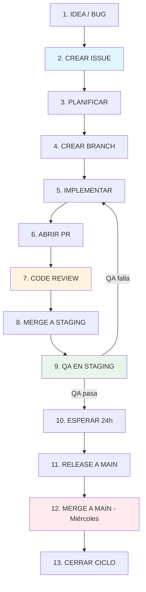

# Flujo de Desarrollo — Catalogo Bukis

> Documento vivo que describe el flujo de trabajo end-to-end del equipo.
> Última actualización: 2026-06-15

---

## Índice
1. Visión General
2. Ciclo de Vida de una Tarea
3. Convenciones del Proyecto
4. Estructura del Proyecto
5. Flujo de Datos de Desarrollo
6. Reglas de Oro
7. Glosario
8. Contactos y Escalación
9. Herramientas
10. Templates de Issue y PR
11. Checklist de Creación de PR

---

## 1. Visión General

El equipo desarrolla un catálogo de productos (e-commerce) con dos repos independientes:

| Repo | Stack | Deploy |
|------|-------|--------|
| `catalogo-bukis-backend` | Django 6 + DRF 3.16 + PostgreSQL | Railway (staging + prod) |
| `catalogo-bukis-frontend` | React 19 + Vite 7 + TypeScript 5.9 | Railway (staging + prod) |

**Flujo de trabajo**: Issue → PR → Review → Merge a `staging` → Deploy automático → QA → Merge a `main` (miércoles) → Producción

---

## 2. El Ciclo de Vida de una Tarea

### 2.1 Crear un Issue

**TODO cambio empieza con un Issue.** No hay excepciones.

**Pasos:**
1. Ir a GitHub Issues del repo correspondiente
2. Crear un issue con título descriptivo
3. Agregar descripción clara (qué, por qué, criterios de aceptación)
4. Labels obligatorios:
   - `type:feature` | `type:bug` | `type:docs` | `type:refactor` | `type:chore`
   - `status:approved` (solo el tech lead/architect aprueba)
5. Asignar milestone si aplica

**Reglas:**
- Sin `status:approved` → NO se puede abrir PR.
- Cada PR debe vincular exactamente UN issue.
- Si un cambio toca backend + frontend, se pueden crear 2 PRs vinculados al mismo issue.

---

### 2.2 Planificación

Para cambios **no triviales** (> 50 líneas, schema change, lógica de negocio nueva):

- Analizar el cambio y documentar en la descripción del issue
- Si el cambio es grande, dividirlo en tareas pequeñas en el body del issue
- Considerar migraciones, impacto en datos, y no-regresiones
- **Cuándo NO necesita planificación formal:** hotfixes de un línea, cambios de texto/copy, ajustes de CSS puros

---

### 2.3 Abrir un PR

**Cada PR debe:**

1. Vincular issue: `Closes #N`, `Fixes #N`, `Resolves #N`
2. Tener exactamente un label `type:*`
3. Nombre de branch: `tipo/descripcion` (ej: `feat/login`, `fix/stock-race`)
4. Commits en formato convencional: `feat(scope): descripcion`
5. Descripción con tabla de cambios y plan de pruebas

**Ejemplo de PR body:**
```markdown
Closes #5

## Summary
- Agrega constraint de unicidad condicional en SKU de variantes

## Changes
| File | Change |
|------|--------|
| `api/models.py` | Agrega UniqueConstraint |

## Test Plan
- [x] `python manage.py test api.tests.test_item_unique` — 7/7 pass
```

**PRs grandes:**
- Si un PR supera 400 líneas de cambio, se debe dividir en slices (chained PRs)
- Cada slice debe ser independiente y mergeable por separado

---

### 2.4 Review del PR

**Quién revisa:**
- El tech lead (architect) revisa todos los PRs
- PRs > 400 líneas se dividen en chained PRs

**Qué se revisa:**
1. ¿Vincula un issue aprobado?
2. ¿Tiene exactamente un label `type:*`?
3. ¿El diff es coherente con el scope del issue?
4. ¿Pasan los tests? (CI debe estar verde)
5. ¿Hay migraciones? ¿Se revisó el impacto?
6. ¿El código sigue las convenciones del proyecto?

**Reglas de aprobación:**
- ✅ Un `approve` del tech lead es suficiente
- ❌ Nunca se hace merge con checks rojos
- ❌ Nunca se hace merge sin review

---

### 2.5 Merge a `staging`

**Branching strategy:**

```
feature branch → staging → main
```

- Todos los PRs se mergean a `staging` primero.
- `staging` deploya automáticamente a la URL de staging.
- Nunca se mergea directamente a `main` desde un feature branch.

---

### 2.6 Deploy a Staging + QA

**Deploy automático:**
- Merge a `staging` → GitHub Actions → deploy a Railway staging

**QA obligatorio:**
1. Verificar que el cambio funciona en staging
2. Verificar que no se rompieron flujos existentes
3. Si hay migraciones, verificar que aplican sin errores
4. Documentar resultado en el PR

**Si QA falla:**
- Se crea un nuevo PR fix vinculado al mismo issue
- Se repite el ciclo

---

### 2.7 Merge a Producción (los Miércoles)

**Calendario de deploys:**

```
Miércoles = Deploy Day
├── Mañana:  Preparar PR de `staging` → `main`
├── Tarde:   Merge a `main` (deploy automático a prod)
└── Post:    Monitoreo por 2 horas
```

**Reglas:**
- Solo el tech lead mergea a `main`
- Solo se mergea si staging está estable por al menos 24h
- Si hay un hotfix crítico, se puede mergear en cualquier día
- Después del merge, se monitorea métricas y logs por 2h

---

## 3. Convenciones del Proyecto

### 3.1 Commits

```
Formato: tipo(alcance): descripcion

feat(api): agregar precio efectivo a variantes
fix(stock): corregir race condition en checkout
test(pricing): agregar tests para precio de variantes
refactor(serializer): extraer helper de imagenes
```

**Tipos permitidos:** `feat`, `fix`, `test`, `refactor`, `chore`, `docs`, `style`, `perf`, `build`, `ci`, `revert`

---

### 3.2 Tests

**Backend (Django):**
- Todos los tests deben pasar antes de abrir PR
- Tests de concurrencia (`select_for_update`) corren en CI (PostgreSQL)
- Comando local: `DATABASE_URL='sqlite:///db.sqlite3' python manage.py test api.tests`

**Frontend (React):**
- `npx tsc -b --noEmit` debe pasar (0 errores)
- `npm run lint` debe pasar (0 errores)
- `npm run build` debe pasar
- Tests automatizados: pendiente (no hay test runner configurado)

---

### 3.3 Migraciones

1. Nunca editar migraciones ya mergeadas
2. Siempre usar `showmigrations` antes de generar una nueva
3. Nombrar migraciones descriptivamente: `0019_alter_variante_add_precio.py`
4. Revisar que `makemigrations --check --dry-run` no detecta drift antes de PR
5. Las migraciones con datos sensibles (audits) deben tener `reverse_code` no-op

---

### 3.4 Labels

| Label | Uso |
|-------|-----|
| `status:approved` | Issue listo para implementar |
| `type:feature` | Nueva funcionalidad |
| `type:bug` | Corrección de bug |
| `type:docs` | Documentación |
| `type:refactor` | Refactor sin cambio de comportamiento |
| `type:chore` | Mantenimiento |
| `type:breaking-change` | Cambio que rompe compatibilidad |

---

## 4. Estructura del Proyecto

```
catalogo-bukis/
├── catalogo-bukis-backend/
│   └── catalogo_backend/
│       ├── api/
│       │   ├── models.py
│       │   ├── serializers.py
│       │   ├── views/
│       │   ├── tests/
│       │   └── migrations/
│       └── manage.py
├── catalogo-bukis-frontend/
│   └── catalogo-frontend/
│       ├── src/
│       │   ├── components/
│       │   ├── types/
│       │   └── services/
│       └── package.json
└── README.md
```

---

## 5. Flujo de Datos de Desarrollo



### Detalle del flujo

1. **IDEA / BUG** — Se identifica necesidad o problema
2. **CREAR ISSUE** — Título claro, descripción, criterios de aceptación, labels
3. **PLANIFICAR** — Analizar impacto, dividir en tareas si es grande
4. **CREAR BRANCH** — `git checkout -b feat/descripcion staging`
5. **IMPLEMENTAR** — Commits convencionales, tests primero (RED) luego código (GREEN)
6. **ABRIR PR** — Body: `Closes #N`, label `type:*`, tabla de cambios
7. **CODE REVIEW** — Tech lead revisa, CI verde, aprobación explícita
8. **MERGE A STAGING** — Deploy automático a Railway staging
9. **QA EN STAGING** — Verificar funcionalidad y no-regresiones
   - Si falla: volver a paso 5 (fix PR)
   - Si pasa: continuar
10. **ESPERAR** — Mínimo 24h estable en staging
11. **PREPARAR RELEASE A MAIN** — PR: `staging` → `main`, changelog
12. **MERGE A MAIN** — Miércoles, deploy automático a producción, monitorear 2h
13. **CERRAR CICLO** — Actualizar issue, post-mortem si fue grande

---

## 6. Reglas de Oro

| # | Regla |
|---|-------|
| 1 | **Todo cambio empieza con un issue.** Sin excepciones. |
| 2 | **Todo PR vincula un issue aprobado.** Sin excepciones. |
| 3 | **Todo PR tiene exactamente un label `type:*`.** |
| 4 | **Staging primero, main después.** Nunca mergear feature directo a main. |
| 5 | **Los miércoles son deploy day.** No deployar a producción otros días (salvo hotfix). |
| 6 | **Tests verdes antes de PR.** Si CI falla, el PR se bloquea. |
| 7 | **Review obligatorio antes de merge.** Nunca auto-merge. |
| 8 | **No editar migraciones mergeadas.** Generar una nueva si se necesita cambio. |
| 9 | **Documentar en el issue para cambios grandes.** Si no cabe en la cabeza, va a la descripción del issue. |
| 10 | **Staging estable 24h antes de producción.** No apurar releases. |

---

## 7. Glosario

| Término | Significado |
|---------|-------------|
| **PR** | Pull Request. Solicitud de merge de un branch a otro. |
| **Chained PR** | PRs divididos en slices secuenciales cuando un cambio es muy grande (> 400 líneas). |
| **Audit** | Revisión de datos antes de aplicar un cambio destructivo (ej: migraciones). |
| **RED/GREEN** | TDD: test que falla (RED) → implementación que lo hace pasar (GREEN). |
| **Staging** | Ambiente de prueba (pre-producción). |
| **Main** | Branch de producción. Solo se mergea desde staging. |

---

## 8. Contactos y Escalación

| Rol | Responsabilidad |
|-----|----------------|
| Tech Lead | Aprobar issues, revisar PRs, mergear a main, decidir arquitectura |
| Developer | Crear issues, implementar, abrir PRs, responder review |
| QA / Stakeholder | Probar en staging, validar criterios de aceptación |

**Escalación:**
- Si un issue no tiene `status:approved` en 48h → ping al tech lead
- Si un PR no tiene review en 24h → ping al tech lead
- Si staging está roto → slack/alerta inmediata, no esperar a miércoles

---

## 9. Herramientas

| Tarea | Herramienta | Comando / URL |
|-------|-------------|---------------|
| Issues | GitHub | `https://github.com/ImpLosBukisHMO/{repo}/issues` |
| PRs | GitHub | `gh pr create` / `gh pr view` |
| CI | GitHub Actions | `.github/workflows/` |
| Deploy | Railway | `railway.app` |
| Staging Backend | URL | `https://optimistic-youth-staging.up.railway.app` |
| Tests Backend | Django | `DATABASE_URL='sqlite:///db.sqlite3' python manage.py test api.tests` |
| Tests Frontend | TypeScript + Lint | `npx tsc -b && npm run lint && npm run build` |

---

## 10. Templates de Issue y PR

### 10.1 Template de Issue

```markdown
## Título
[tipo]: Breve descripción del cambio

Ejemplo: [feat]: Agregar filtro de categoría en productos

## Descripción
### Qué
Describir qué se quiere lograr.

### Por qué
Explicar la motivación o problema que resuelve.

### Criterios de aceptación
- [ ] Criterio 1
- [ ] Criterio 2
- [ ] Criterio 3

### Notas técnicas
- Si hay migraciones, mencionarlas
- Si hay dependencias con otros issues, vincularlos
- Si hay riesgos, documentarlos

### Recursos
- Mockups, documentos, o links relevantes
```

### 10.2 Template de PR

```markdown
## Closes #N

## Resumen
- 1-3 bullets de qué hace este PR

## Cambios
| Archivo | Cambio |
|---------|--------|
| `path/to/file` | Qué cambió |

## Plan de pruebas
- [ ] Backend tests pasan: `python manage.py test`
- [ ] Frontend build pasa: `tsc -b && npm run lint && npm run build`
- [ ] QA en staging completado (si aplica)

## Checklist
- [ ] Issue vinculado: Closes #N
- [ ] Issue tiene `status:approved`
- [ ] Label `type:*` agregado
- [ ] No hay secrets en el diff
- [ ] Descripción incluye tabla de cambios
```

---

## 11. Checklist de Creación de PR

Copiar y pegar en el body de cada PR:

```markdown
## Checklist
- [ ] Issue vinculado: Closes #N
- [ ] Issue tiene `status:approved`
- [ ] Label `type:*` agregado
- [ ] Tests pasan (backend: `python manage.py test`, frontend: `tsc -b && npm run lint`)
- [ ] Migraciones revisadas (si aplica)
- [ ] No hay secrets ni credenciales en el diff
- [ ] Descripción incluye tabla de cambios
- [ ] QA en staging completado (si aplica)
```

---

> **Nota:** Este documento es un contrato social del equipo. Si algo no funciona, se discute y se actualiza. La meta es calidad, no velocidad.
