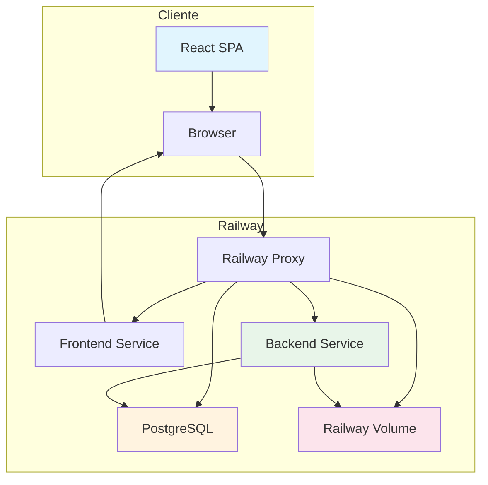
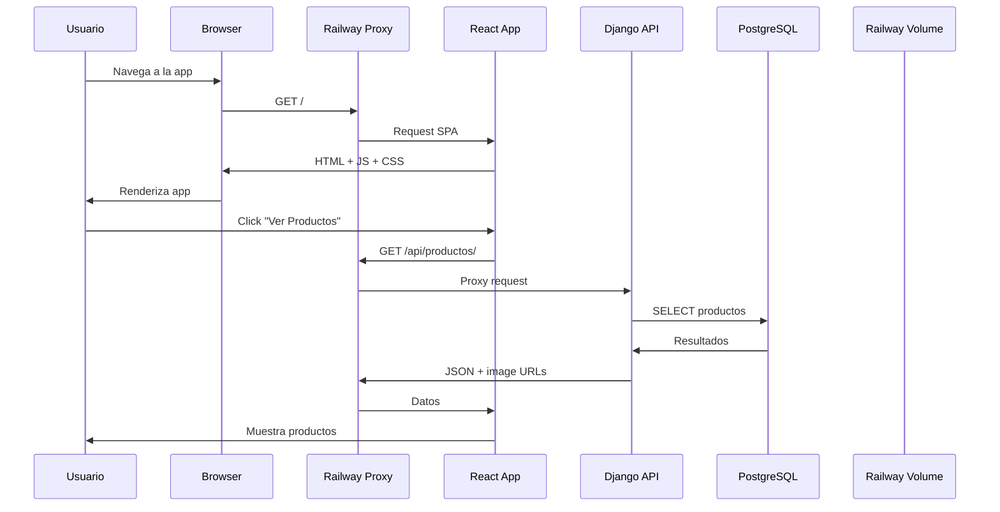
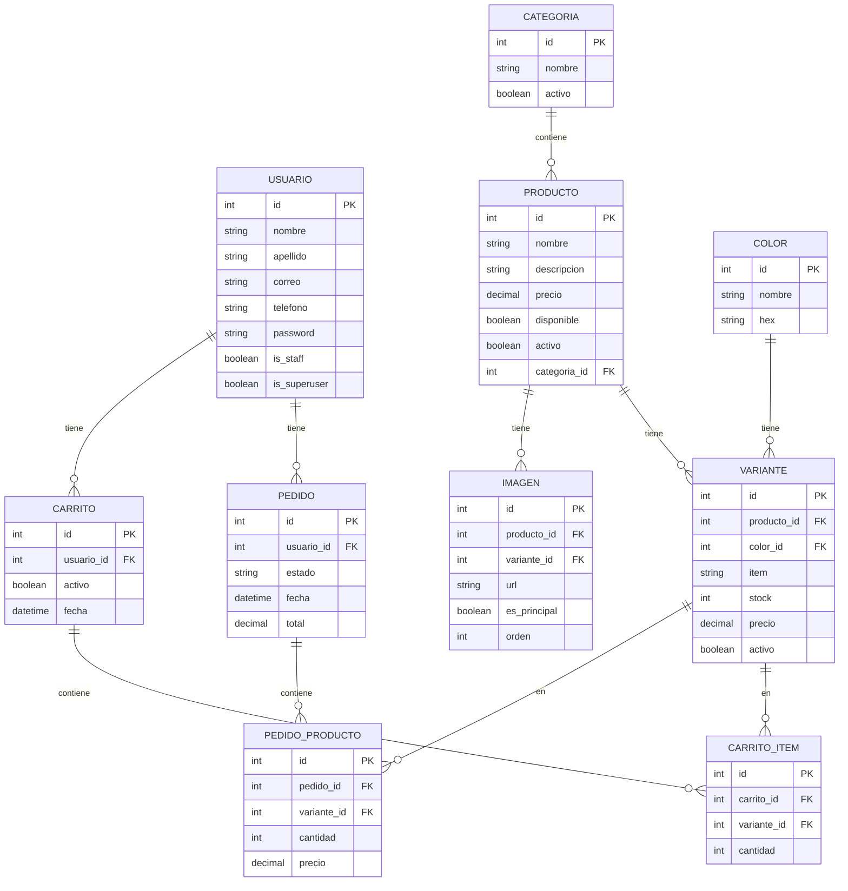
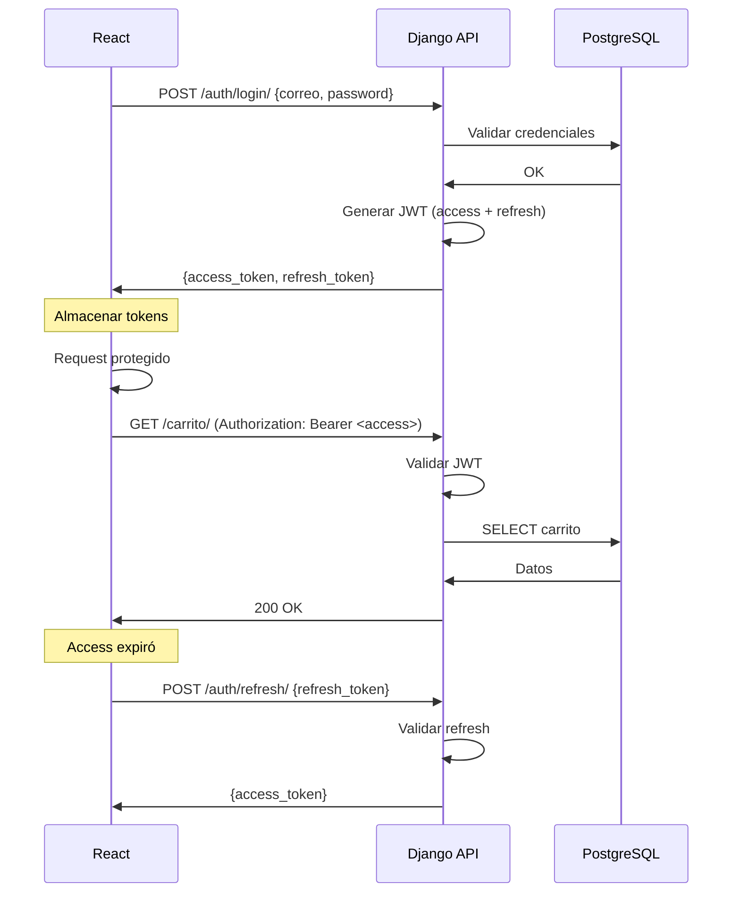
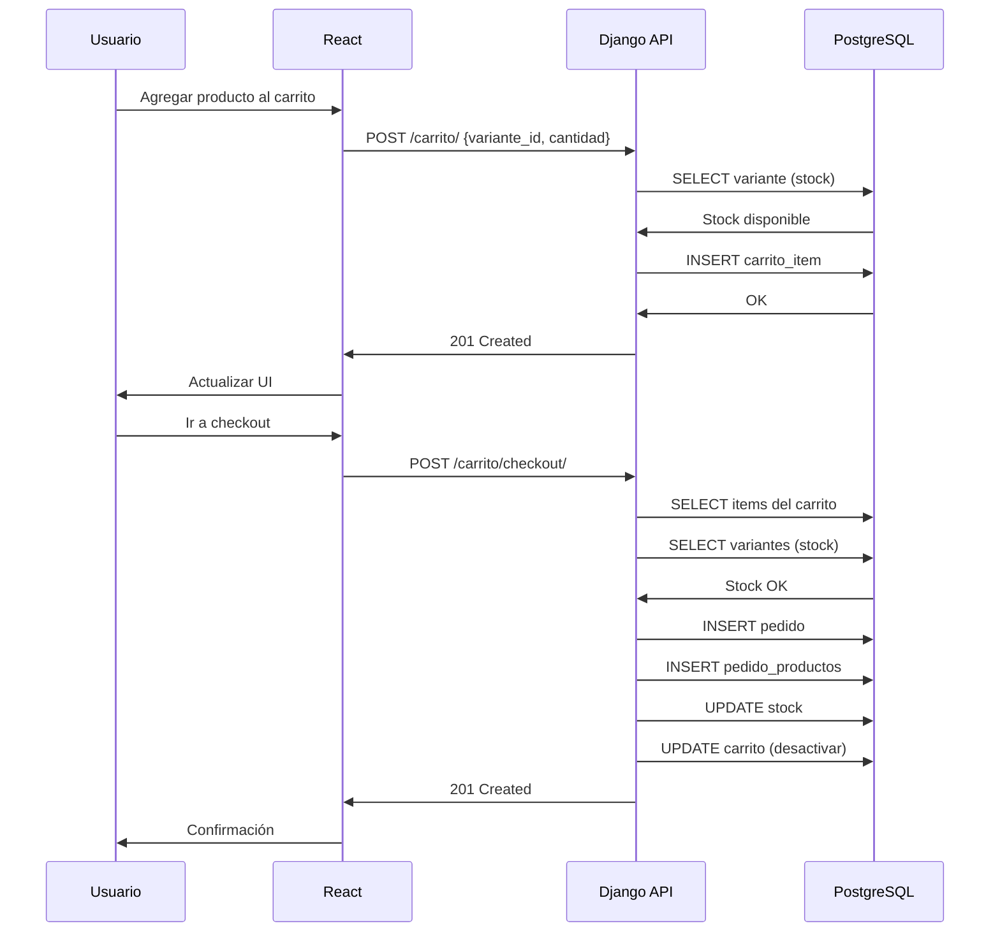
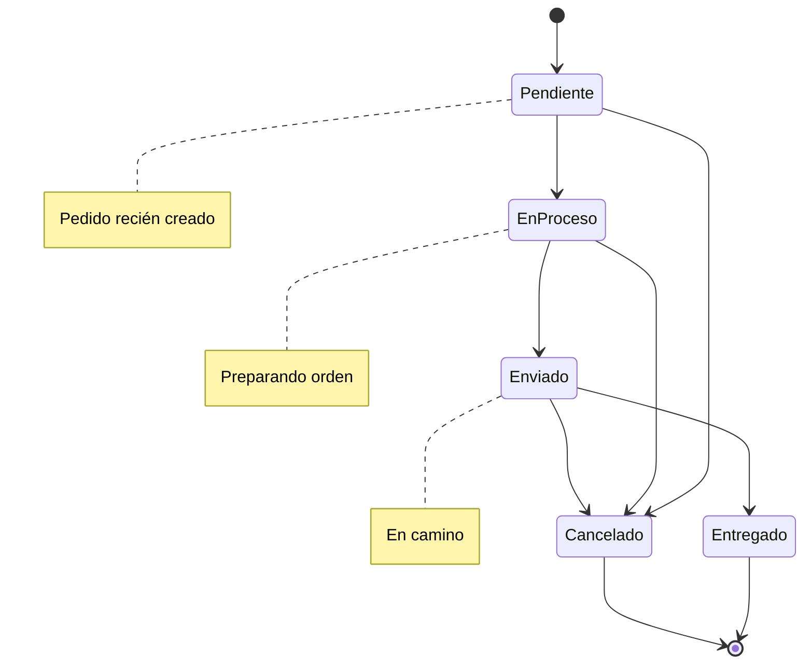
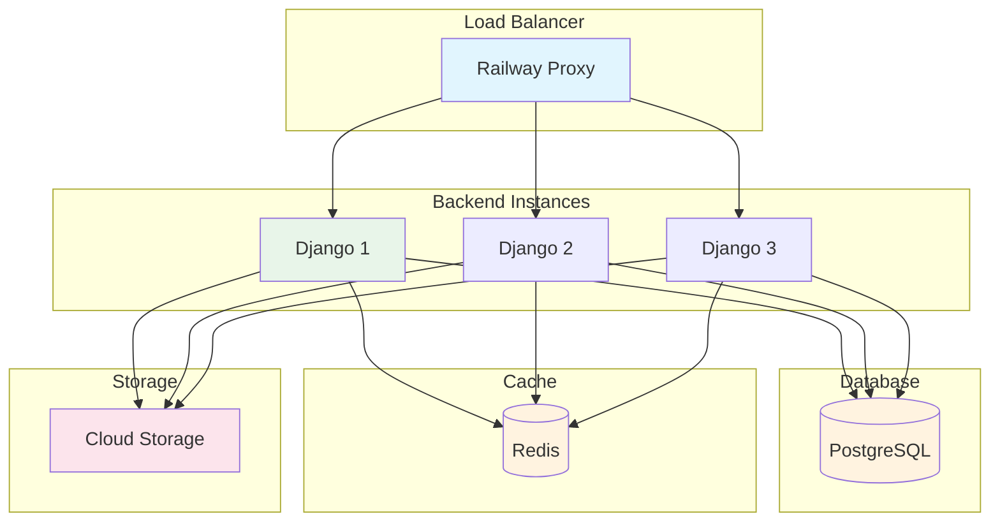
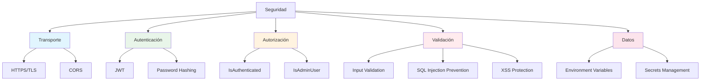
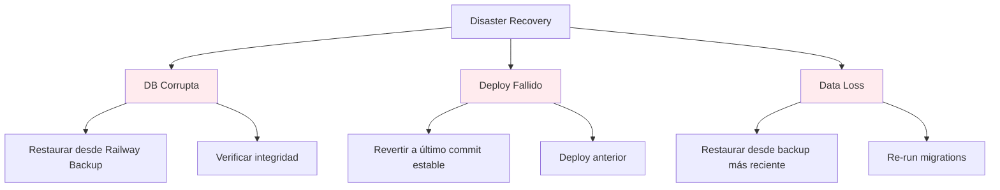

# Arquitectura del Sistema

## Visión General

Catalogo Bukis es una aplicación e-commerce de catálogo de productos con las siguientes características:

---

## Componentes Principales

### Frontend

| Componente | Tecnología | Rol |
|------------|-----------|-----|
| **React SPA** | React 19 + Vite | Interfaz de usuario |
| **Tailwind CSS** | CSS Framework | Estilos utilitarios |
| **Bulma** | CSS Framework | Componentes base |
| **TanStack Query** | Data Fetching | Cache y sincronización |
| **Axios** | HTTP Client | Comunicación con API |

### Backend

| Componente | Tecnología | Rol |
|------------|-----------|-----|
| **Django** | Python Framework | Framework web |
| **DRF** | REST Framework | API RESTful |
| **SimpleJWT** | Auth Library | Autenticación JWT |
| **PostgreSQL** | Database | Persistencia de datos |
| **Railway Volume** | File Storage | Almacenamiento de imágenes locales |

---

## Flujo de Request

---

## Base de Datos

### Diagrama Entidad-Relación

---

## Autenticación

### JWT Flow

---

## Carrito de Compras

---

## Estados del Pedido

---

## Escalabilidad

### Horizontal

**Consideraciones:**
- Railway maneja automáticamente el scaling horizontal
- PostgreSQL puede manejar miles de conexiones
- Railway Volume para almacenamiento de imágenes locales
- Redis para cache de sesiones (opcional)

---

## Seguridad

### Capas de Seguridad

---

## Performance

### Optimizaciones

| Área | Optimización | Impacto |
|------|-------------|---------|
| **Imágenes** | Railway Volume | Almacenamiento local persistente |
| **DB** | Índices + `select_related` | Menos queries N+1 |
| **Frontend** | Code splitting + lazy loading | Bundle más pequeño |
| **API** | Paginación | Respuestas más rápidas |
| **Cache** | TanStack Query | Menos requests al backend |
| **Assets** | Railway CDN | Static files rápidos |

---

## Monitoreo

### Métricas a monitorear

| Métrica | Herramienta | Umbral |
|---------|------------|--------|
| **Response time** | Railway Logs | < 500ms |
| **Error rate** | Railway Logs | < 1% |
| **DB connections** | PostgreSQL | < 80% |
| **Memory usage** | Railway | < 80% |
| **CPU usage** | Railway | < 80% |
| **Uptime** | Railway | > 99% |

---

## Backup y Recuperación

### Estrategia

| Componente | Backup | Frecuencia |
|------------|--------|------------|
| **Base de datos** | Railway automatic backups | Diario |
| **Imágenes** | Railway Volume | Con backup de Railway |
| **Código** | GitHub | Cada commit |

### Recuperación

---

> **Nota:** Esta documentación se actualiza con cada cambio significativo de arquitectura.
