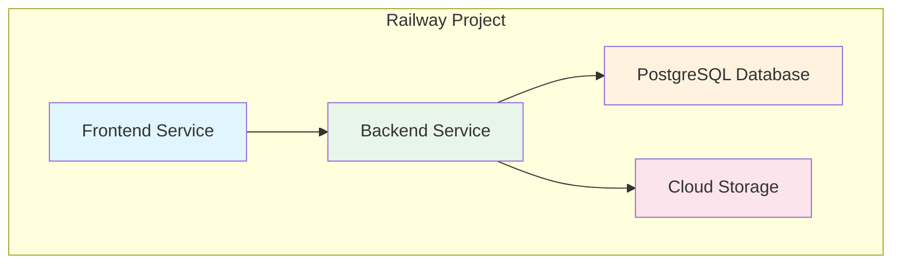
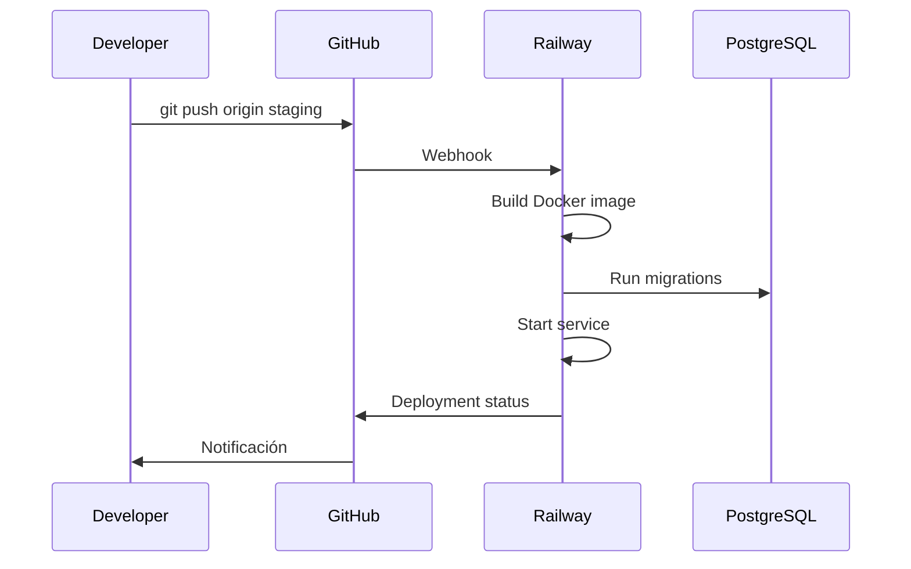
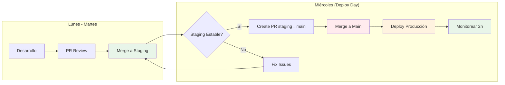
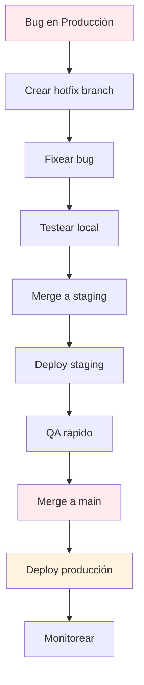
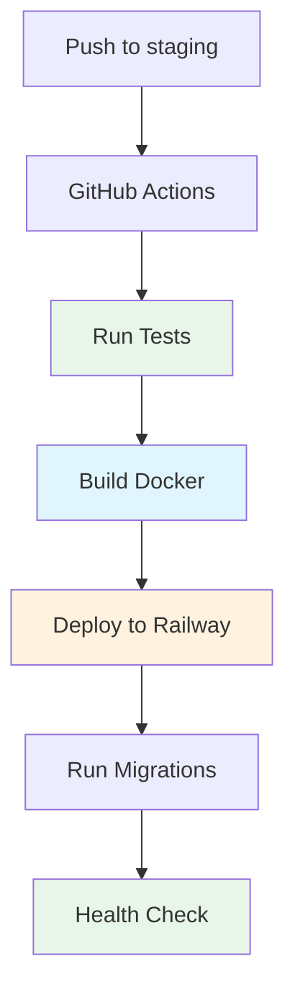

# Guía de Deploy

## Environments

| Environment | Branch | URL | Base de datos |
|-------------|--------|-----|---------------|
| **Local** | `feature/*` | `http://localhost:8000` | SQLite |
| **Staging** | `staging` | `https://optimistic-youth-staging.up.railway.app` | PostgreSQL |
| **Producción** | `main` | `https://optimistic-youth.up.railway.app` | PostgreSQL |

---

## Railway

### Configuración



### Servicios

| Servicio | Tipo | Puerto | Variables |
|----------|------|--------|-----------|
| Frontend | Static | 3000 | `NODE_ENV=production` |
| Backend | Web | 8000 | `DATABASE_URL`, `SECRET_KEY`, etc. |
| PostgreSQL | Database | 5432 | Auto-generada por Railway |

---

## Deploy a Staging

### 1. Preparar código

```bash
# Asegurarse de estar en staging
git checkout staging
git pull origin staging

# Mergear feature branch
git merge feature/nueva-funcionalidad

# Push
git push origin staging
```

### 2. Railway deploy automático



### 3. Verificar deploy

```bash
# Verificar health check
curl https://optimistic-youth-staging.up.railway.app/api/health/

# Verificar logs
railway logs

# Verificar migraciones
railway run python manage.py showmigrations
```

---

## Deploy a Producción

### Calendario



### Proceso manual

```bash
# 1. Asegurarse que staging está estable
# - Tests pasan
# - QA completado
# - No hay errores en logs

# 2. Crear PR de staging a main
gh pr create \
  --title "Release: Deploy to production" \
  --body "Deploying changes from staging to production" \
  --base main \
  --head staging

# 3. Mergear PR (solo tech lead)
gh pr merge --admin

# 4. Monitorear
# - Verificar Railway logs
# - Verificar health checks
# - Verificar métricas
```

### Checklist pre-deploy

- [ ] Todos los tests pasan en staging
- [ ] QA completado y aprobado
- [ ] Migraciones aplicadas correctamente
- [ ] No hay errores en logs
- [ ] Performance aceptable
- [ ] Backup de base de datos actualizado

---

## Variables de Entorno

### Backend

```env
# Django
SECRET_KEY=<super-secret-key>
DEBUG=False
ALLOWED_HOSTS=optimistic-youth.up.railway.app

# Database (Railway auto-genera)
DATABASE_URL=postgresql://...

# JWT
JWT_SECRET_KEY=<jwt-secret>

# CORS
CORS_ALLOWED_ORIGINS=https://optimistic-youth.up.railway.app

# Cloudinary
CLOUDINARY_URL=cloudinary://...
```

### Frontend

```env
# API URL
VITE_API_URL=https://optimistic-youth.up.railway.app

# Stripe (si aplica)
VITE_STRIPE_PUBLIC_KEY=pk_live_...
```

---

## Migrations

### En staging

```bash
# Verificar migraciones pendientes
railway run python manage.py showmigrations

# Aplicar migraciones
railway run python manage.py migrate

# Verificar que no hay drift
railway run python manage.py makemigrations --check --dry-run
```

### En producción

```bash
# Backup antes de migrar
railway run python manage.py dumpdata > backup.json

# Aplicar migraciones
railway run python manage.py migrate

# Verificar
railway run python manage.py showmigrations
```

---

## Rollback

### Rollback de código

```bash
# Revertir último commit
git revert HEAD

# O revertir a un commit específico
git revert abc123

# Push
git push origin main
```

### Rollback de base de datos

```bash
# Restaurar desde backup
railway run python manage.py loaddata backup.json

# O revertir migraciones
railway run python manage.py migrate api <migration_name>
```

---

## Monitoreo

### Logs

```bash
# Ver logs en tiempo real
railway logs

# Ver logs históricos
railway logs --tail 100

# Filtrar por servicio
railway logs --service backend
```

### Métricas

| Métrica | Comando | Umbral |
|---------|---------|--------|
| Response time | `railway logs` | < 500ms |
| Error rate | `railway logs` | < 1% |
| CPU usage | Railway Dashboard | < 80% |
| Memory usage | Railway Dashboard | < 80% |
| DB connections | Railway Dashboard | < 80% |

### Health Checks

```bash
# Backend health
curl https://optimistic-youth.up.railway.app/api/health/

# Frontend health
curl https://optimistic-youth.up.railway.app/
```

---

## Hotfix

### Proceso de hotfix



### Comandos

```bash
# Crear hotfix desde main
git checkout main
git checkout -b hotfix/critical-bug

# Fixear bug
# ... código ...

# Commit y push
git add .
git commit -m "fix: critical bug"
git push origin hotfix/critical-bug

# PR a staging
gh pr create --base staging --head hotfix/critical-bug

# Merge a staging
gh pr merge

# Deploy staging (automático)
# ... verificar ...

# PR a main
gh pr create --base main --head staging

# Merge a main
gh pr merge

# Deploy producción (automático)
# ... monitorear ...
```

---

## CI/CD

### GitHub Actions



### Workflow

```yaml
# .github/workflows/deploy.yml
name: Deploy

on:
  push:
    branches: [staging, main]

jobs:
  test:
    runs-on: ubuntu-latest
    steps:
      - uses: actions/checkout@v3
      - name: Setup Python
        uses: actions/setup-python@v4
        with:
          python-version: '3.12'
      - name: Install dependencies
        run: pip install -r requirements.txt
      - name: Run tests
        run: python manage.py test

  deploy:
    needs: test
    runs-on: ubuntu-latest
    steps:
      - uses: actions/checkout@v3
      - name: Deploy to Railway
        run: railway up
        env:
          RAILWAY_TOKEN: ${{ secrets.RAILWAY_TOKEN }}
```

---

## Troubleshooting

### Error comunes

| Error | Causa | Solución |
|-------|-------|----------|
| `502 Bad Gateway` | Servicio caído | Verificar logs, reiniciar servicio |
| `Database connection error` | PostgreSQL no responde | Verificar DATABASE_URL, reiniciar DB |
| `Migration error` | Migraciones conflictivas | Revertir y aplicar manualmente |
| `Static files 404` | No se sirven estáticos | Verificar `STATIC_ROOT` y `STATIC_URL` |
| `CORS error` | Origen no permitido | Verificar `CORS_ALLOWED_ORIGINS` |

### Comandos útiles

```bash
# Verificar estado de servicios
railway status

# Reiniciar servicio
railway restart

# Escalar servicio
railway scale --service backend --replicas 2

# Ver variables de entorno
railway variables

# Shell en el contenedor
railway run bash

# Django shell
railway run python manage.py shell

# Database shell
railway run python manage.py dbshell
```

---

## Scripts

### Deploy script

```bash
#!/bin/bash
# deploy.sh

set -e

echo "🚀 Starting deploy..."

# Tests
echo "🧪 Running tests..."
python manage.py test

# Build
echo "🔨 Building..."
npm run build

# Deploy
echo "📦 Deploying to Railway..."
railway up

# Health check
echo "🏥 Health check..."
curl -f https://api.example.com/api/health/ || exit 1

echo "✅ Deploy successful!"
```

---

> **Nota:** Ver [WORKFLOW.md](../WORKFLOW.md) para el flujo de trabajo del equipo.
