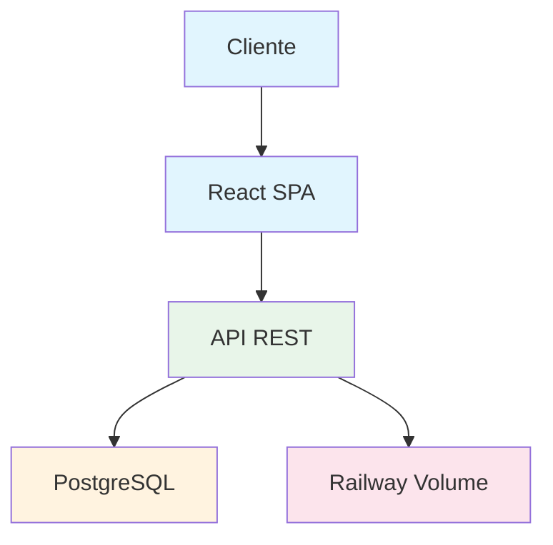

# Documentación del Proyecto

## Índice

| Documento | Descripción |
|-----------|-------------|
| [ARCHITECTURE.md](./ARCHITECTURE.md) | Arquitectura del sistema, diagramas ER, flujos de datos |
| [API.md](./API.md) | Documentación completa de la API REST |
| [DEPLOYMENT.md](./DEPLOYMENT.md) | Guía de deploy a Railway, monitoreo, rollback |
| [WORKFLOW.md](../WORKFLOW.md) | Flujo de trabajo del equipo (en raíz del repo) |

---

## Arquitectura

## Stack Tecnológico

| Capa | Tecnología |
|------|-----------|
| **Frontend** | React 19 + Vite + TypeScript |
| **Backend** | Django 6 + DRF |
| **Base de datos** | PostgreSQL 16 |
| **Auth** | JWT (SimpleJWT) |
| **Deploy** | Railway |
| **Imágenes** | Railway Volume |

---

## Para empezar

1. Ver [README.md](../README.md) para instalación y setup
2. Ver [ARCHITECTURE.md](./ARCHITECTURE.md) para entender la arquitectura
3. Ver [API.md](./API.md) para usar la API
4. Ver [DEPLOYMENT.md](./DEPLOYMENT.md) para deployar
5. Ver [WORKFLOW.md](../WORKFLOW.md) para el flujo de trabajo del equipo

---

> **Nota:** Esta documentación se mantiene actualizada con cada cambio del proyecto.
